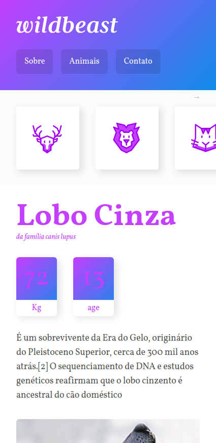
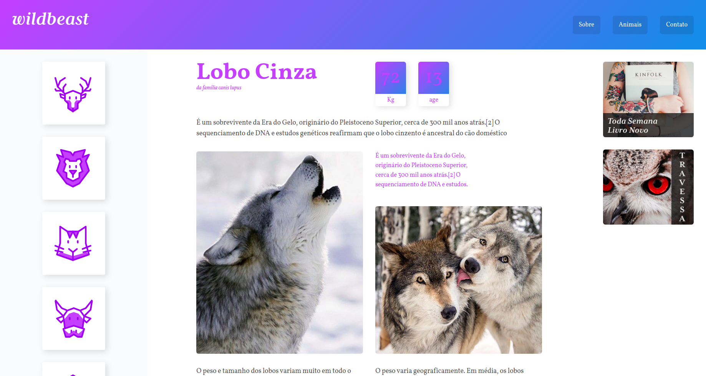

# Projeto WildBest

Projeto WildBest desenvolvido durante aula de CSS Grid da [Origamid](https://www.origamid.com/)


## __**Diferenciais:**__
* **SASS e variáveis**: Utilizando o pré-processador [SASS](https://sass-lang.com/), conseguimos manter a organização.   
As variáveis facilitam na manutenção do site, mantendo a consistência e padrão.
  
* **Componentes**: A componetização facilita a manutenção, organização e torna o código muito mais entendível.


## Instalação

1- Baixe o repositório

2- No terminal rode o comando:

```bash
npm i 
```

3- Para compilar o CSS:
```bash
yarn scss
``` 
ou
```bash
npm run scss
```  
<br/>  
<br/>
<br/>

# Layout


  
  
<br/>
<br/>
<br/>


## **Materiais Apoio**
[Grid Container -Origamid](https://www.origamid.com/projetos/css-grid-layout-guia-completo/)  
[Grid BY Example -By Rachel Andrew In](https://gridbyexample.com/)  
[Documentação](https://www.w3.org/TR/css-grid-1/)